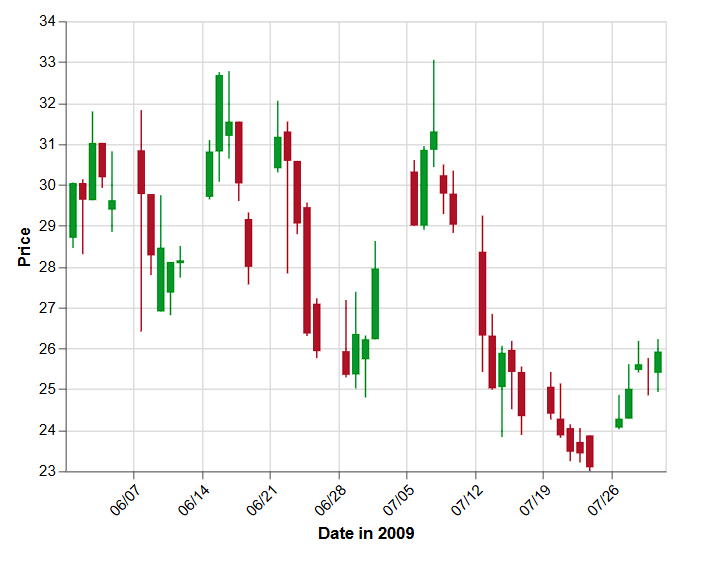

## Homework 5
## Exercise 2 — Visualization Gallery Analysis

a) Include a copy of the graphic and a link to the webpage where it lives.
Here is the chart I chose:  
[Candlestick Chart (Vega-Lite example)](https://vega.github.io/vega-lite/examples/layer_candlestick.html)

{width=80%}

b) What marks are being used? What variables are mapped to which properties?
Rectangles (bars) to show the opening and closing prices for each day
Lines to show the highest and lowest prices for each day

x-axis = dat/time
y-axis = price
height of the rectangle = difference between open and close price
line length = range between high and low price
color = weather the price went up and down - green means price increased and red means price decreased

c) What is the main story of this graphic?

main story for the graphic is how the price changes over time and shows the price is moving up and down. 

d) What makes it a good graphic?

shows a lot of information in a compact way
color is easy to read with information - green=increased, red=decreased
Maybe this kind of graph is perfect for financial data

e)What features do you think you would know how to implement in Vega-Lite?

basic bar and line marks, mapping date to the x-axis and price to the y-axis, using color to represent up and down, and labels and titles

f)Are there any features of the graphic that you would not know how to do in Vega-Lite? If so, list them.

layering multiple marks precisely to form candlesticks, creating conditional coloring based on open vs close price.

## Exercise 3
(I chose exercise 2 and 3 from the slides)

### Slide Exercise 2 — Mean temperature by month

**How many “months” should you display?**
I chose to display 12 months (January–December) by combining all years together. This makes the seasonal temperature pattern easier to see and keeps the graph simple and clear.

```{r}
#| message: false
library(vegawidget)

spec_ex2 <- '{
  "$schema": "https://vega.github.io/schema/vega-lite/v5.json",
  "data": {
    "url": "https://calvin-data304.netlify.app/data/weather-with-dates.csv"
  },
  "transform": [
    {
      "calculate": "(datum.temp_max + datum.temp_min) / 2",
      "as": "temp_avg"
    }
  ],
  "mark": "bar",
  "encoding": {
    "x": {
      "field": "month",
      "type": "ordinal",
      "title": "Month",
      "sort": ["1","2","3","4","5","6","7","8","9","10","11","12"]
    },
    "y": {
      "aggregate": "mean",
      "field": "temp_avg",
      "type": "quantitative",
      "title": "Mean Temperature (°C)"
    },
    "tooltip": [
      {"field": "month", "type": "ordinal", "title": "Month"},
      {
        "aggregate": "mean",
        "field": "temp_avg",
        "type": "quantitative",
        "title": "Mean Temp (°C)",
        "format": ".2f"
      }
    ]
  },
  "title": "Mean Temperature in Seattle by Month"
}'

spec_ex2 |> as_vegaspec()
```

### Slide Exercise 3 — Weather types by month

```{r}
#| message: false
library(vegawidget)

spec_ex3 <- '{
  "$schema": "https://vega.github.io/schema/vega-lite/v5.json",
  "data": {
    "url": "https://calvin-data304.netlify.app/data/weather-with-dates.csv"
  },
  "mark": "bar",
  "encoding": {
    "x": {
      "field": "month",
      "type": "ordinal",
      "title": "Month",
      "sort": ["1","2","3","4","5","6","7","8","9","10","11","12"]
    },
    "y": {
      "aggregate": "count",
      "type": "quantitative",
      "title": "Number of days"
    },
    "color": {
      "field": "weather",
      "type": "nominal",
      "title": "Weather"
    },
    "tooltip": [
      {"field": "month", "type": "ordinal", "title": "Month"},
      {"field": "weather", "type": "nominal", "title": "Weather"},
      {"aggregate": "count", "type": "quantitative", "title": "Days"}
    ]
  },
  "title": "Weather types in Seattle by month"
}'

spec_ex3 |> as_vegaspec()
```

**Rainiest:** December (month 12)

**Sunniest:** August (month 8)