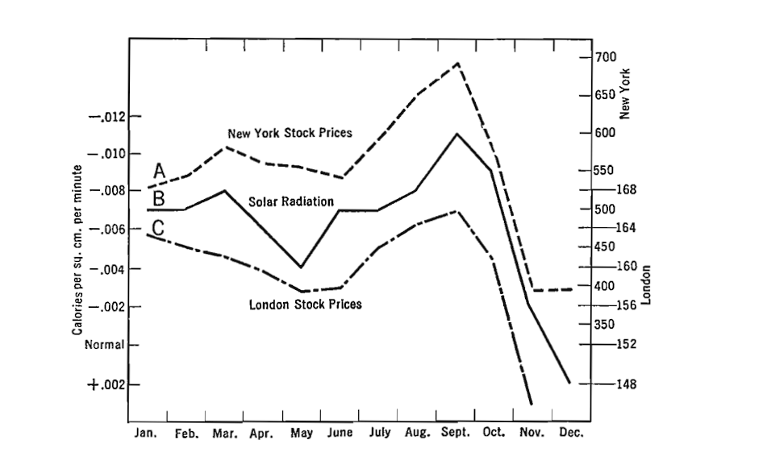

HW 6: Tufte and Composition

## Exercise 1
a) I think Tufte gives us the most important lesson and adivce on the page 13:
-Show the data clearly
-Avoid distorting what the data have to say
-Present many numbers in a small space
-Make large data sets coherent
-Encourage comparison
-Reveal data at several levels of detail

b) What page is your graphic on? [Take a screen shot and include the image as well, if you can.]
Its on page 15
{width=80%}


Why did you pick the graphic you chose?
I chose this graph because it compares three times series in one compact chart. 


What encoding channels are used in the graphic? What variables are they associated with?
X-axis = months (time)
Y-axis = solar radiation (left) and stock prices (right)
Lines = represents change over time
Line style = distinguishes variables


What, if any, elements of the graphic would be hard/impossible for you to implement in Vega-Lite (given what we know so far)?
creating dual y-axes with seperate scale would be hard in Vega-lite. It would require me doing layering charts and carefully adjusting scale settings.


What point is Tufte illustrating with this graphic?
Tufte uses this graphic to show how visuals can encourage comparison and reveal patterns efficiently.


##Exercise 2
1) one key idea I learned is that bar charts must start at zero. Changing the baseline can exaggerate differences and mislead the biew.

Another key takeaway is to focus on the "So What?" instead of showing all the data. I should be able to degisn visuals around the main message


## Exercise 3

```{r}
#| message: false
#| echo: false
library(vegawidget)

spec_ex3 <- '{
  "$schema": "https://vega.github.io/schema/vega-lite/v5.json",
  "data": {
    "values": [
      {"Date":"Q1-2017","Completion Rate":0.91,"Response Rate":0.023},
      {"Date":"Q2-2017","Completion Rate":0.93,"Response Rate":0.018},
      {"Date":"Q3-2017","Completion Rate":0.91,"Response Rate":0.028},
      {"Date":"Q4-2017","Completion Rate":0.89,"Response Rate":0.023},
      {"Date":"Q1-2018","Completion Rate":0.84,"Response Rate":0.034},
      {"Date":"Q2-2018","Completion Rate":0.88,"Response Rate":0.027},
      {"Date":"Q3-2018","Completion Rate":0.91,"Response Rate":0.026},
      {"Date":"Q4-2018","Completion Rate":0.87,"Response Rate":0.039},
      {"Date":"Q1-2019","Completion Rate":0.83,"Response Rate":0.028}
    ]
  },

  "layer": [
    {
      "transform": [{"calculate": "datum[\\\"Completion Rate\\\"]", "as": "Rate"}],
      "mark": {"type": "line", "point": true},
      "encoding": {
        "x": {"field": "Date", "type": "ordinal", "title": "Quarter"},
        "y": {"field": "Rate", "type": "quantitative", "axis": {"format": "%"}, "title": "Rate"},
        "color": {"value": "#1f77b4"}
      }
    },
    {
      "transform": [{"calculate": "datum[\\\"Response Rate\\\"]", "as": "Rate"}],
      "mark": {"type": "line", "point": true},
      "encoding": {
        "x": {"field": "Date", "type": "ordinal"},
        "y": {"field": "Rate", "type": "quantitative"},
        "color": {"value": "#ff7f0e"}
      }
    }
  ],

  "title": "Completion Rate vs. Response Rate Over Time"
}'

spec_ex3 |> as_vegaspec()
```

b) After reading Knaflic, I focused on simplifying the visual and removing unecessary elements. Instead of using dual axes, I used a shared percent scale to avoid misleading comparison. I also used clean lines with points to make the trends over time easier to see.


